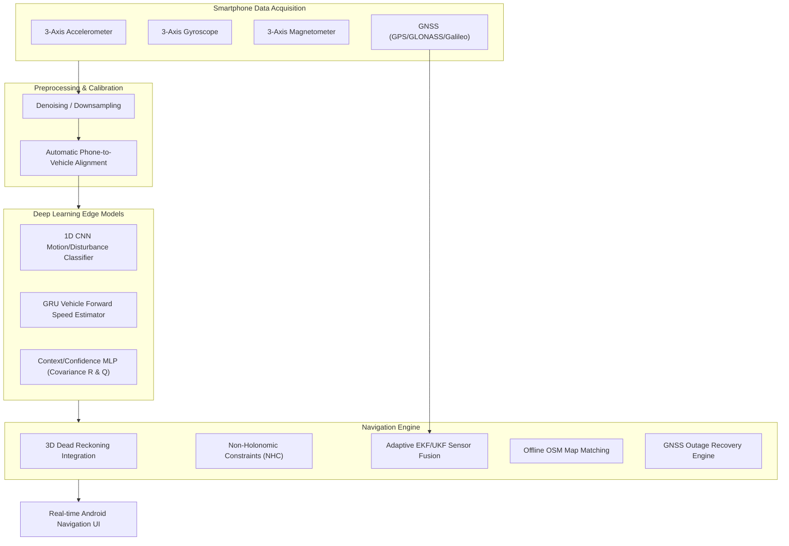

# SIH26168 – AI-ML Based Intelligent Dead Reckoning System for Seamless Navigation

[](https.python.org)
[](https://pytorch.org/)
[](https://developer.android.com/)

---

## 📌 Project Overview

**SIH26168** is an edge-deployable, AI/ML-assisted Intelligent Dead Reckoning (IDR) navigation system designed to provide uninterrupted vehicle positioning during **GNSS outages** (e.g., urban canyons, tunnels, underground passes, dense foliage).

By coupling raw smartphone IMU sensors (accelerometer, gyroscope, magnetometer) with real-time deep learning models, non-holonomic constraints (NHC), adaptive EKF/UKF sensor fusion, and offline OpenStreetMap (OSM) map matching, the system maintains accurate vehicle trajectory tracking without relying continuously on satellite fixes.

---

## 🏗 System Architecture & Workflow



---

## 📂 Directory Responsibilities

The codebase is modularized cleanly into distinct engineering domains:

```
AI-IDR/
├── dataset/             # Dataset acquisition guidelines, raw and processed IMU/GNSS recordings
├── ml/                  # Deep learning models, preprocessing pipelines, training scripts, and evaluation
├── navigation/          # Core navigation physics engine, phone alignment, EKF/UKF fusion, OSM matching
├── android/             # Android Studio Kotlin app source for edge collection, ONNX inference & UI
├── backend/             # Lightweight FastAPI server for telemetry logging and map data provisioning
├── docs/                # Architectural diagrams, system specifications, and proposal docs
├── requirements.txt     # Python dependency configuration
├── README.md            # Master project documentation
└── .gitignore           # Git ignore policy rules
```

### Detailed Folder Breakdown

1. **`dataset/`**:
   - `raw/`: Unprocessed sensor log files (CSV/HDF5) collected from mobile devices.
   - `processed/`: Time-aligned, calibrated, and windowed numpy array frames ready for ML consumption.
   - `README.md`: Detailed dataset schema guidelines and data collection protocol.

2. **`ml/`**:
   - `notebooks/`: Jupyter notebooks for exploratory data analysis (EDA), signal inspection, and visualization.
   - `preprocessing/`: Raw IMU data loaders, noise filtering (Butterworth/Kalman), normalization, and window generation.
   - `models/`: PyTorch models for:
     - 1D CNN dynamic motion and road disturbance classification.
     - GRU vehicle forward speed regression.
     - Context/Confidence MLP predicting dynamic noise covariance ($R$ and $Q$).
     - ONNX/TFLite edge export pipeline (`exporter.py`).
   - `training/`: Standardized scripts for training, validation splits, early stopping, and checkpoint saving.
   - `evaluation/`: Trajectory error metrics (ATE, RPE) and plotting scripts.
   - `outputs/`: Saved model weights (`.pt`, `.onnx`), training logs, and performance plots.

3. **`navigation/`**:
   - `alignment/`: Automatic phone orientation to vehicle body coordinate frame transformation.
   - `dead_reckoning/`: 3D kinematic dead reckoning propagation engine and Non-Holonomic Constraint (NHC) enforcement.
   - `sensor_fusion/`: Adaptive Extended Kalman Filter (EKF) and Unscented Kalman Filter (UKF) integrating IMU, ML velocity, and GNSS observations.
   - `map_matching/`: Offline OpenStreetMap graph ingestion and Hidden Markov Model (HMM) road map matching.

4. **`android/`**:
   - Mobile client application for real-time sensor recording, running ONNX models on-device, running the navigation engine, and displaying the map UI.

5. **`backend/`**:
   - FastAPI server for uploading recorded trajectories, syncing map tiles/graphs, and running batch evaluations.

6. **`docs/`**:
   - Deep-dive technical specifications, API contracts, and SIH26168 challenge documentation.

---

## ⚡ Quick Start & Development Setup

### 1. Environment Setup
```bash
# Clone repository
git clone https://github.com/your-org/AI-IDR.git
cd AI-IDR

# Create virtual environment
python -m venv venv

# Activate virtual environment (Windows)
venv\Scripts\activate
# On Linux/macOS: source venv/bin/activate

# Install dependencies
pip install -r requirements.txt
```

### 2. Module Validation
```bash
# Verify Python import hierarchy
python -c "import ml; import navigation; print('Packages loaded successfully!')"
```

---

## 📜 Next Development Steps

- [ ] Populate `dataset/` with reference IMU/GNSS driving logs.
- [ ] Implement IMU coordinate transformation in `navigation/alignment/phone_vehicle_aligner.py`.
- [ ] Build preprocessing routines in `ml/preprocessing/cleaner.py`.
- [ ] Train GRU forward velocity model in `ml/training/train_velocity.py`.
- [ ] Implement Adaptive EKF state propagation and measurement updates in `navigation/sensor_fusion/ekf_fusion.py`.
- [ ] Integrate ONNX runtime into the Android client app in `android/`.

---

## ⚖ License & Acknowledgments
Developed for **Smart India Hackathon (SIH) 2026** under Problem Statement **SIH26168**.
